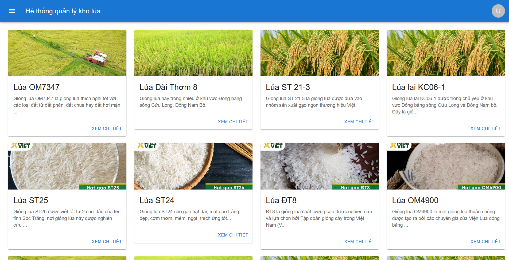
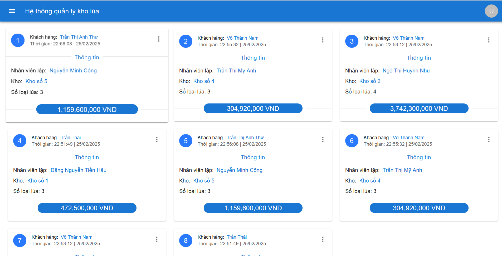
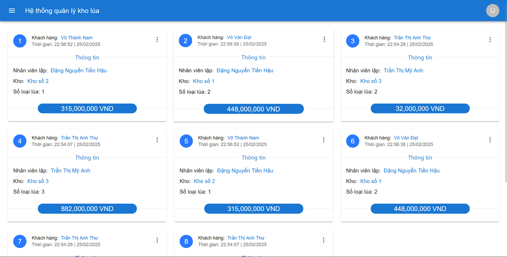
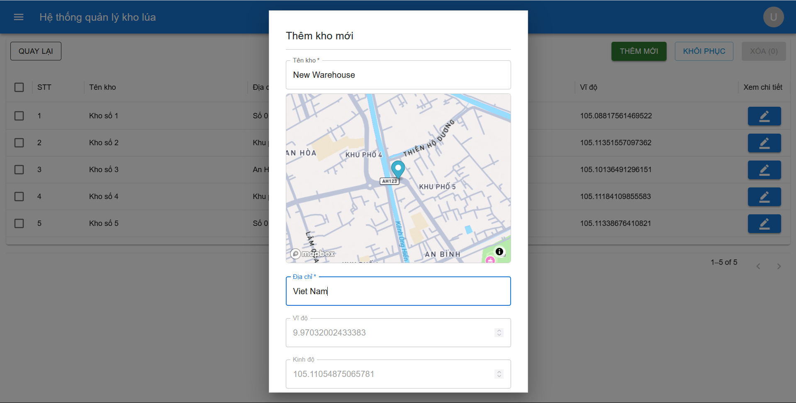
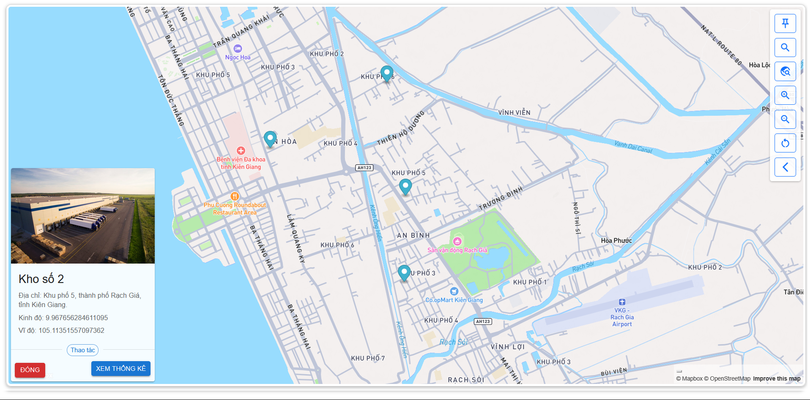
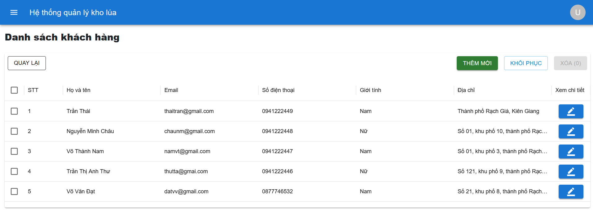
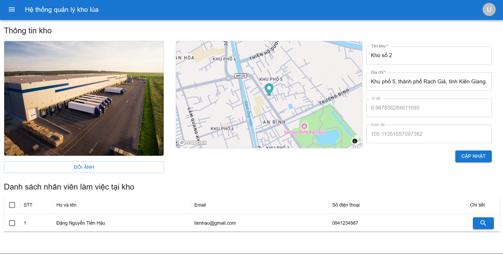

## Website quản lý nhiều chi nhánh kho lúa tích hợp Mapbox API
<b><i>Đề tài cá nhân</i></b>
- <b>Người thực hiện: </b> Đặng Nguyễn Tiền Hậu
- <b>Thời gian: </b>07/2024 - 10/2024
-----------------------
- Dự án hướng tới việc tạo một website quản lý kho lúa để người quản lý có thể giám sát thông tin nhiều kho (nhân viên, nhập - xuất,...)
- Quá trình quản lý sẽ được triển khai trực quan trên bản đồ để quy trình quản lý thuận tiện hơn.

<h4>Một số hình ảnh của dự án</h4>
<h5>Giao diện Website</h5>

  
  

  
  

  
  

  
  

-----------------------
### Các tính năng chính
1. Đăng nhập và xác thực với JWT Token.
2. Quản lý một số đối tượng:
    - Quản lý (CRUD) tài khoản.
    - Quản lý (CRUD) thông tin đơn nhập & xuất.
    - Quản lý (CRUD) thông tin nhân viên làm việc tại từng kho.
    - Quản lý (CRUD) thông tin kho.
    - Quản lý (CRUD) thông tin lúa.
    - Quản lý (CRUD) thông tin khách hàng

-----------------------------------------------
### Kết quả
<b>Ưu diểm: </b>
- Website hoạt động tốt, các chức năng cơ bản và nâng cao đều ổn định.
- Bản đồ Mapbox giúp thể hiện thông tin trực quan và nhanh chóng, giúp quá trình quản lý dễ dàng hơn.

<b>Hạn chế: </b>
- Website chỉ gói gọn trong quy mô là đề tài cá nhân, chưa triển khai trong thực tế.
- Các chức năng vẫn còn lỗi nhỏ.

-----------------------------------------------
### Liên Hệ
Nếu bạn có bất kỳ câu hỏi nào hoặc muốn đóng góp cho dự án, hãy liên hệ với tôi qua:

- Email: [tienhau.it@gmail.com](mailto:tienhau.it@gmail.com)
- GitHub: [Thomas Dang](https://github.com/HauDNT)
- LinkedIn: [Hau Dang](https://www.linkedin.com/in/haudnt/)